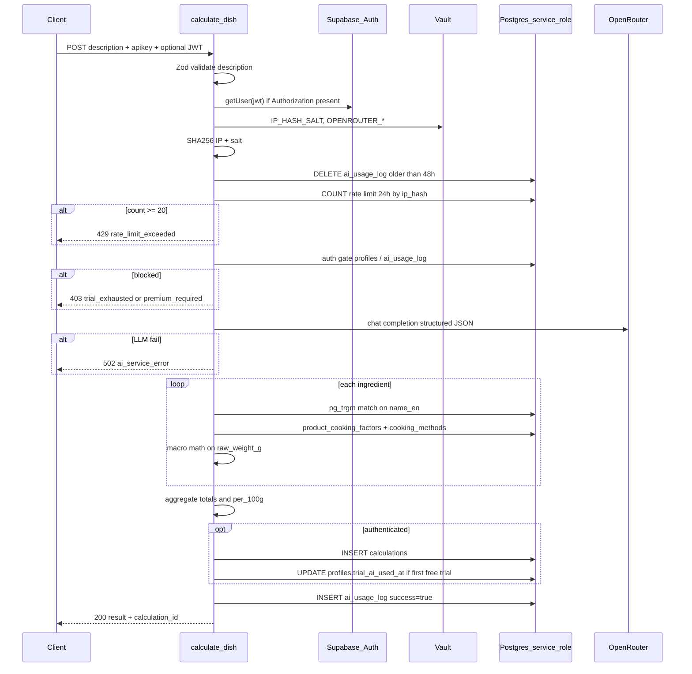

# API Endpoint Implementation Plan: POST /functions/v1/calculate-dish

Docelowy artefakt po akceptacji planu: zapis w `[.ai/view-implementation-plan.md](.ai/view-implementation-plan.md)` (ten sam content).

---

## 1. Przegląd punktu końcowego

**Cel:** Jedyny endpoint biznesowy AI w MVP — przyjmuje opis dania w języku naturalnym, wywołuje OpenRouter, mapuje składniki na produkty z bazy (`products` + `product_cooking_factors`), liczy makroskładniki deterministycznie i zwraca wynik z opcjonalnymi ostrzeżeniami (US-015).

**Warstwa:** Supabase Edge Function (Deno 2, TypeScript) pod `[supabase/functions/calculate-dish/](supabase/functions/calculate-dish/)` — **brak istniejących funkcji** w repozytorium; implementacja od zera.

**Kluczowe zasoby DB (już zmigrowane):**

- `[ai_usage_log](supabase/migrations/20260506120800_create_ai_usage_log.sql)` — rate limit + trial anonimowy
- `[profiles](supabase/migrations/20260506120600_create_profiles.sql)` — `trial_ai_used_at`, `is_premium`, `premium_expires_at`
- `[calculations](supabase/migrations/20260506120700_create_calculations.sql)` — historia dla JWT (`type = 'dish'`)
- `[products](supabase/migrations/20260506120300_create_products.sql)` — makra per 100 g; kolumna wyszukiwania: `**name_en` (po migracji rename)
- Indeksy trgm: `[idx_products_name_trgm](supabase/migrations/20260506120900_create_indexes.sql)` (kolumna podąża za rename)

**Zewnętrzne zależności:** OpenRouter API; sekrety z Supabase Vault / `supabase secrets`.

---

## 2. Szczegóły żądania

| Aspekt          | Wartość                                                                                |
| --------------- | -------------------------------------------------------------------------------------- |
| **Metoda HTTP** | `POST`                                                                                 |
| **URL**         | `{SUPABASE_URL}/functions/v1/calculate-dish`                                           |
| **Auth**        | Opcjonalny JWT w `Authorization: Bearer <token>`; zawsze wymagany `apikey: <anon_key>` |

### Parametry

**Wymagane (nagłówki):**

- `apikey` — klucz anon Supabase
- `Content-Type: application/json`

**Opcjonalne (nagłówki):**

- `Authorization: Bearer <jwt>` — tożsamość użytkownika; brak = tryb anonimowy

**Wymagane (body):**

- `description` — `string`, po trim: długość **1–3000** znaków (źródło prawdy: [api-plan §4.3](.ai/api-plan.md); **nie** 2000 z kroku wewnętrznego flow)

**Opcjonalne (body):** brak

### Request body

```json
{
	"description": "pierś z kurczaka 200g pieczona, ziemniaki 300g gotowane, brokuł 150g"
}
```

**Walidacja wejścia (Zod, granica HTTP):**

- `description`: `z.string().trim().min(1).max(3000)`
- Błędy: `400` + `{ "error": "description_required" \| "description_too_long" }`

---

## 3. Wykorzystywane typy (DTO / Command / Domain)

Umiejscowienie: `supabase/functions/calculate-dish/` (+ opcjonalnie eksport do klientów w `shared/types/calculate-dish.ts` w kolejnym PR).

### Request / Response DTO

```typescript
// schemas.ts — Zod + inferred types
CalculateDishRequestSchema; // { description: string }
CalculateDishResponseSchema; // success 200 body
ErrorResponseSchema; // { error: string; message?: string; reset_at?: string }
```

### LLM DTO (OpenRouter)

```typescript
LlmIngredientSchema = z.object({
	name: z.string().min(1),
	cooking_method: z.enum(["boiling", "frying", "baking"]),
	weight_g: z.number().positive(),
	// rekomendacja: dodać opcjonalnie cooked_weight_g gdy brak yield w DB (patrz §8 krok 3)
	cooked_weight_g: z.number().positive().optional(),
});
LlmIngredientsArraySchema = z.array(LlmIngredientSchema).min(1);
```

### Command / wewnętrzne modele

| Typ                         | Rola                                                     |
| --------------------------- | -------------------------------------------------------- | ----------------------------------------------------- |
| `CalculateDishCommand`      | `{ description, userId: string                           | null, ipHash: string }`                               |
| `AuthContext`               | `{ userId, isPremium, premiumExpiresAt, trialAiUsedAt }` |
| `MatchedIngredient`         | produkt DB + similarity + yield + macros                 |
| `MacroTotals`               | `{ calories_kcal, protein_g, fat_g, carbs_g }`           |
| `DishWarning`               | `{ ingredient, issue: "unrecognized"                     | "yield_source_ai", yield_factor_estimated?: number }` |
| `PersistCalculationCommand` | payload INSERT do `calculations`                         |

### Mapowanie na `[database.types.ts](supabase/types/database.types.ts)`

- `CalculationsInsert` z `type: 'dish'`, `input_text`, `input` / `result` / `warnings` jako `Json`
- `AiUsageLogInsert`: `{ ip_hash, user_id?, success: true }`
- `ProfilesUpdate`: `{ trial_ai_used_at }` tylko przez `service_role`

### Struktura `calculations` dla `type = 'dish'`

| Kolumna                                        | Wartość                                                                                                  |
| ---------------------------------------------- | -------------------------------------------------------------------------------------------------------- |
| `type`                                         | `'dish'`                                                                                                 |
| `input_text`                                   | oryginalny `description`                                                                                 |
| `direction`, `product_id`, `cooking_method_id` | `NULL`                                                                                                   |
| `input`                                        | `{ "description": "...", "llm_ingredients": [...] }`                                                     |
| `result`                                       | obiekt zgodny z [db-plan § dish result](.ai/db-plan.md) (`total_weight_g`, `total`, `per_100g`, `items`) |
| `warnings`                                     | tablica lub `null`                                                                                       |

---

## 4. Szczegóły odpowiedzi

### Sukces — `200 OK`

Body zgodny ze specyfikacją ([api-plan 508–561](.ai/api-plan.md)):

- `calculation_id: string | null` — UUID po INSERT dla JWT; `null` dla anonima
- `total_weight_g`, `total`, `per_100g`, `items[]`, `warnings: null | DishWarning[]`
- Pola makro: `calories_kcal`, `protein_g`, `fat_g`, `carbs_g` (nie skróty `kcal` z mocka web)

### Błędy — kody i kształt

| HTTP  | `error`                | Kiedy                                                |
| ----- | ---------------------- | ---------------------------------------------------- |
| `400` | `description_required` | pusty po trim                                        |
| `400` | `description_too_long` | > 200 znaków                                         |
| `401` | `invalid_token`        | JWT obecny, ale `getUser()` niepowodzenie            |
| `403` | `trial_exhausted`      | anon + ≥1 wpis `ai_usage_log` dla `ip_hash` (sukces) |
| `403` | `premium_required`     | free user + `trial_ai_used_at IS NOT NULL`           |
| `429` | `rate_limit_exceeded`  | ≥20 wpisów / 24h / IP; body: `{ error, reset_at }`   |
| `500` | `internal_error`       | nieobsłużony wyjątek                                 |
| `502` | `ai_service_error`     | OpenRouter timeout/błąd/parsing Zod                  |

**Uwaga premium:** Gate dla użytkownika premium — `is_premium === true` **oraz** (`premium_expires_at IS NULL` **lub** `premium_expires_at > now()`) zgodnie z [api-plan §4.6](.ai/api-plan.md) (szersze niż skrót w kroku 6c).

**Nie używać w tym endpoincie:** `201` (brak tworzenia zasobu REST), `404` (brak identyfikatora w URL).

---

## 5. Przepływ danych



### Warstwa serwisowa (vertical slice)

| Moduł                         | Odpowiedzialność                                                                                                                                                      |
| ----------------------------- | --------------------------------------------------------------------------------------------------------------------------------------------------------------------- |
| `index.ts`                    | CORS, routing, mapowanie HTTP ↔ serwis, correlation ID                                                                                                                |
| `calculate-dish.service.ts`   | Orkiestracja kroków 1–15 ze specyfikacji                                                                                                                              |
| `authorization.service.ts`    | JWT, profile gate, reguły trial/premium                                                                                                                               |
| `rate-limit.service.ts`       | lazy cleanup, count 24h, `reset_at`                                                                                                                                   |
| `openrouter.client.ts`        | HTTP adapter (timeout ~30s, brak retry na MVP)                                                                                                                        |
| `product-matcher.service.ts`  | zapytanie trgm + próg similarity                                                                                                                                      |
| `macro-calculator.service.ts` | wzór zgodny z `[product-calculator.tsx](web/src/components/product-calculator.tsx)`: `macros = (raw_weight_g/100) * per_100g`, `cooked_weight_g = raw * yield_factor` |
| `calculation-repository.ts`   | INSERT `calculations`, UPDATE `profiles`, INSERT `ai_usage_log`                                                                                                       |
| `lib/ip-hash.ts`              | SHA-256(`salt + ip`)                                                                                                                                                  |
| `lib/supabase-admin.ts`       | klient `createClient(url, SERVICE_ROLE_KEY)`                                                                                                                          |

**Dopasowanie produktu (SQL przez service_role):**

```sql
select id, name_en, calories_kcal, protein_g, fat_g, carbs_g,
       similarity(name_en, $1) as matched_confidence
from products
where deleted_at is null
  and name_en % $1
order by matched_confidence desc
limit 1;
```

- Próg: stała `PRODUCT_MATCH_MIN_SIMILARITY = 0.3` (konfigurowalna; brak w spec — ustalić w code review)
- Brak wiersza lub poniżej progu → `warnings: { issue: "unrecognized" }`, pomiń w sumach

**OpenRouter:** system + user prompt z [api-plan § OpenRouter](.ai/api-plan.md); model z `OPENROUTER_MODEL`.

**Po sukcesie LLM dopiero:** INSERT `ai_usage_log` i ewentualnie trial update (US-027 — failed LLM **nie** loguje sukcesu).

---

## 6. Względy bezpieczeństwa

| Zagrożenie                | Mitigacja                                                                                        |
| ------------------------- | ------------------------------------------------------------------------------------------------ |
| Wyciek `service_role`     | Tylko w runtime Edge; nigdy w kliencie ([tech-stack](.ai/tech-stack.md))                         |
| Fałszywy `user_id` w body | Tożsamość wyłącznie z JWT (`auth.getUser`)                                                       |
| Raw IP w DB               | SHA-256 + sól z Vault (`IP_HASH_SALT`)                                                           |
| Prompt injection          | Opis traktowany jako dane użytkownika; system prompt sztywny; walidacja Zod na wyjściu LLM       |
| Abuse / koszty LLM        | 20 req/24h/IP; trial 1/IP anon; 1 trial/free user                                                |
| SQL injection             | Parametryzowane zapytania / Supabase client                                                      |
| CORS                      | Jawna lista origin (Expo web, produkcja); nie `*` w prod                                         |
| JWT optional              | Anon dozwolony z `apikey`; invalid JWT → `401` (nie fallback anon)                               |
| RLS bypass                | `service_role` tylko dla `ai_usage_log`, `trial_ai_used_at`, INSERT historii — z `user_id` z JWT |

**Nagłówki:** `X-Forwarded-For` / `cf-connecting-ip` — jedna ustalona kolejność odczytu IP; udokumentować w kodzie.

---

## 7. Obsługa błędów

### Tabela błędów w DB

**Nie dotyczy** — w schemacie MVP **brak** tabeli `error_log`. Rejestrowanie:

- `console.error` / structured JSON logs w Edge (poziom `error`/`warn`, bez PII: bez raw IP, bez pełnego opisu w prod jeśli wrażliwy)
- **Nie** INSERT do `ai_usage_log` przy `success = false` (wyjątek: przyszły audyt — poza MVP)

### Macierz scenariuszy

| Scenariusz                       | HTTP                                                                                                                                                       | Log                                      |
| -------------------------------- | ---------------------------------------------------------------------------------------------------------------------------------------------------------- | ---------------------------------------- |
| Invalid JSON body                | `400` / `500`                                                                                                                                              | warn                                     |
| OpenRouter 5xx / timeout         | `502`                                                                                                                                                      | error + latency                          |
| LLM invalid JSON                 | `502`                                                                                                                                                      | error (fragment odpowiedzi max N znaków) |
| DB connection fail               | `500`                                                                                                                                                      | error                                    |
| Premium expired mid-request      | `403` premium_required                                                                                                                                     | info                                     |
| Wszystkie składniki unrecognized | `200` + warnings (puste totals lub same warningi — zdefiniować min. 1 rozpoznany składnik vs pusty wynik; rekomendacja: `200` z totals=0 jeśli brak items) |                                          |

### Format odpowiedzi błędu

```json
{ "error": "rate_limit_exceeded", "reset_at": "2026-05-09T10:00:00Z" }
```

`reset_at` = `MIN(called_at) + 24h` z okna rate limit dla danego `ip_hash`.

---

## 8. Rozważania dotyczące wydajności

| Wąskie gardło         | Strategia                                                                                                                               |
| --------------------- | --------------------------------------------------------------------------------------------------------------------------------------- |
| OpenRouter latency    | Timeout 25–30s; brak równoległych wywołań LLM na request                                                                                |
| N× zapytań produktów  | Batch: jedna funkcja RPC `match_products(ingredients text[])` (opcjonalna migracja) lub `Promise.all` z limitem współbieżności 5        |
| Lazy DELETE 48h       | `DELETE ... WHERE called_at < now() - interval '48 hours'` — indeks `(ip_hash, called_at)` już istnieje                                 |
| Rate limit COUNT      | `COUNT(*)` z `WHERE ip_hash = $1 AND called_at > now() - interval '24 hours'` — indeks wspiera                                          |
| Cold start Deno       | `per_worker` w [config.toml](supabase/config.toml); minimalne importy w `index.ts`                                                      |
| Historia 100 rekordów | Trigger `[trg_limit_calculations_per_user](supabase/migrations/20260506121200_create_limit_calculations_trigger.sql)` — bez logiki w EF |

---

## 9. Etapy wdrożenia

### Krok 1 — Szkielet Edge Function

- `supabase functions new calculate-dish`
- Wpis w `[supabase/config.toml](supabase/config.toml)`: `[functions.calculate-dish]`, `verify_jwt = false` (ręczna weryfikacja opcjonalnego JWT)
- `deno.json` / import map: `@supabase/supabase-js`, `zod`
- Health: `OPTIONS` + `GET` → `{ status: "ok" }` (opcjonalnie)

### Krok 2 — Konfiguracja i sekrety

- Lokalnie: `.env` / `supabase secrets set` dla `OPENROUTER_API_KEY`, `OPENROUTER_MODEL`, `IP_HASH_SALT`
- Vault na hosted: zgodnie z [api-plan §5](.ai/api-plan.md)
- Helper odczytu sekretów z fallback `Deno.env.get`

### Krok 3 — Schematy Zod i typy odpowiedzi

- Request/response/error schemas
- Ujednolicenie promptu LLM z `cooked_weight_g` **lub** dokumentowany fallback `yield_factor = 1.0` + warning `yield_source_ai` (rozjazd api-plan prompt vs krok 9d)

### Krok 4 — Infrastruktura współdzielona

- `supabase-admin.ts`, `ip-hash.ts`, `http-response.ts` (mapowanie status + JSON)
- CORS middleware

### Krok 5 — Rate limit + authorization

- `rate-limit.service.ts`: cleanup 48h, count 24h, `reset_at`
- `authorization.service.ts`: anon trial, free trial, premium check
- Testy jednostkowe (Deno test) z mock DB

### Krok 6 — OpenRouter client

- Adapter izolowany ([brt-implementing-backend — External Service Adapters](file:///Users/bartoszjaniuk/.agents/skills/brt-implementing-backend/SKILL.md))
- Mapowanie błędów HTTP → `AiServiceError`

### Krok 7 — Product matching + makra

- Zapytania na `name_en`, `active_products` / `deleted_at IS NULL`
- Join `product_cooking_factors` + `cooking_methods.slug`
- `macro-calculator.service.ts` — testy jednostkowe ze znanymi wartościami USDA

### Krok 8 — Orkiestracja `calculate-dish.service.ts`

- Pełny pipeline kroków 1–15
- Agregacja `total` / `per_100g` / `total_weight_g`

### Krok 9 — Persistencja

- INSERT `calculations` tylko gdy `userId != null`
- UPDATE `trial_ai_used_at` gdy: authenticated, `!isPremium`, `trial_ai_used_at IS NULL`, po sukcesie
- INSERT `ai_usage_log` na końcu sukcesu

### Krok 10 — HTTP handler `index.ts`

- Obsługa wszystkich kodów błędów ze specyfikacji
- `Content-Type: application/json`

### Krok 11 — Testy integracyjne

- `supabase start` + `supabase functions serve`
- Scenariusze: happy path anon, trial exhausted, rate limit (seed 20 rows), JWT valid + save calculation, invalid JWT, description validation, mock OpenRouter (inject test double)

### Krok 12 — Dokumentacja i integracja klientów

- Aktualizacja `[.ai/supabase-rest-guide.md](.ai/supabase-rest-guide.md)` jeśli rozjazd
- Mobile (`[mobile/](mobile/)`): helper jak §8.1 guide
- Web: zamiana mock `[web/src/pages/api/ai.ts](web/src/pages/api/ai.ts)` / `[ai-calculator.tsx](web/src/components/ai-calculator.tsx)` na proxy do Edge Function (osobny task UI — limit 800 vs 200 API: **zsynchronizować** z 200)

### Krok 13 — Wdrożenie i weryfikacja

- `supabase functions deploy calculate-dish`
- Smoke test na staging z prawdziwym OpenRouter
- Monitor kosztów OpenRouter

### Opcjonalna migracja (zalecana przed prod)

Jeśli `similarity(name_en, ...)` jest wolne — dodać migrację `match_product_by_name(p_ingredient text)` jako `SECURITY DEFINER` w schemacie prywatnym lub potwierdzić, że indeks trgm na `name_en` działa po rename (PostgreSQL przenosi indeks z kolumną).

---

## Decyzje do potwierdzenia w review

1. **Limit znaków:** 200 (API) vs 800 (obecny UI web) — UI musi zejść do 200 przed produkcją.
2. **Próg similarity:** domyślnie `0.3` — do kalibracji na seed data.
3. **Prompt LLM:** czy rozszerzyć o `cooked_weight_g` dla `yield_source_ai`, czy `yield_factor = 1.0`.
4. **Pusty wynik:** czy zwracać `200` gdy wszystkie składniki `unrecognized`, czy `422` — spec sugeruje partial success `200`.

---

## Pliki do utworzenia (referencja)

```
supabase/functions/calculate-dish/
  index.ts
  deno.json
  schemas.ts
  types.ts
  services/calculate-dish.service.ts
  services/authorization.service.ts
  services/rate-limit.service.ts
  services/openrouter.client.ts
  services/product-matcher.service.ts
  services/macro-calculator.service.ts
  repositories/calculation.repository.ts
  lib/supabase-admin.ts
  lib/ip-hash.ts
  lib/errors.ts
  lib/cors.ts
  __tests__/macro-calculator.test.ts
  __tests__/authorization.test.ts
```

Opcjonalnie: `shared/types/calculate-dish.ts` dla Expo + Astro.
